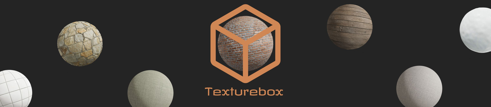

# Welcome to the Archive Box (a.k.a the Texturebox Registry)

This is where all textures in the Library Box are stored. With that you can contribute to them too!

Just open a pull request on this repository.

Okay, now there are some rules to get your texture approved and to have a pull request made.

1. You MUST follow the format which is listed below.

```json
{
  "name": "theTextureName",
  "provider": "Who provided the texture (Don't include yourself if its under a license)",
  "thumbail": "rbxassetid://The Thumbnail Id shwowing on the Library (Must be Image Id not Decal Id)",
  "textureId": "rbxassetid://The actual Texture Id (Must be Image Id not Decal Id)"
}
```

2. You MUST include a license if you took the texture from a open source texture provider.

3. Send a pull request.
